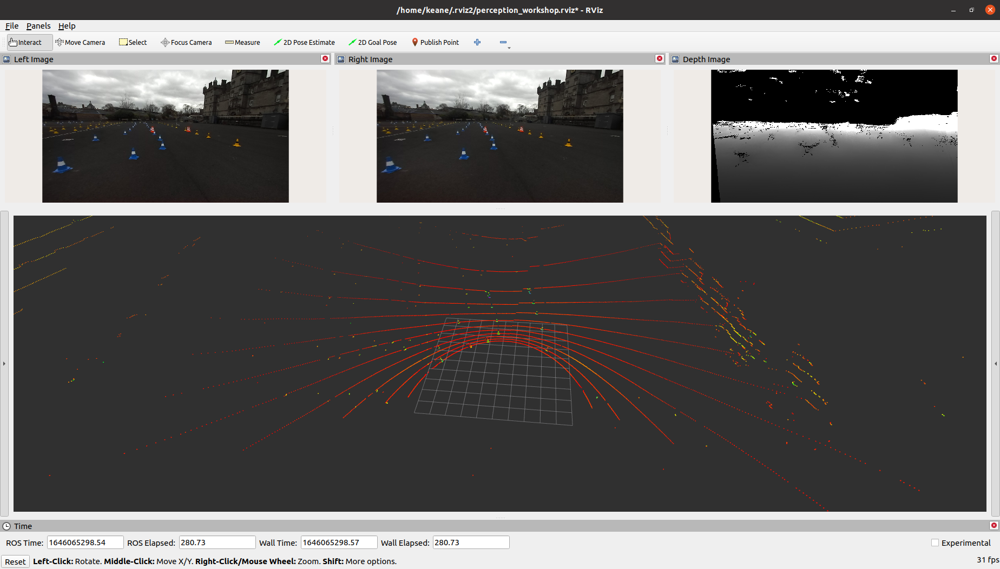
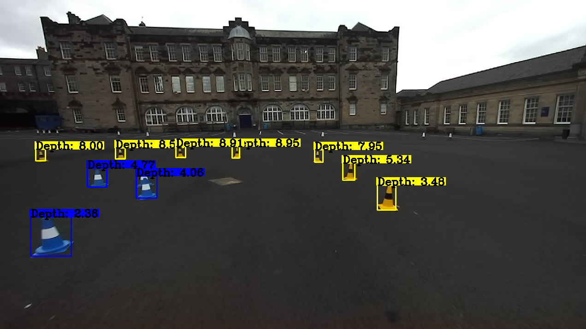

# Perception

The main purpose of this module is to introduce tools available in ROS and in the wider open source community for use in perception tasks. For this exercise, we will focus on using data from a stereo-camera. However, for those interested, point cloud data from a LiDAR is included in the dataset provided.

The exercise assumes some understanding of basic ideas in ROS such as nodes, publishers, subscribers, topics and messages. These were covered in the [previous module of the Mobile Robotics Crash Course](https://gitlab.com/eufs/admin/mobile-robotics-crash-course/-/tree/master/1.%20Introduction%20to%20ROS). However, in saying this, most of the code dealing with the surrounding ROS infrastructure has been written for you so that we can focus on the perception problem.

## Setup

Assuming you have the [Mobile Robotics Crash Course repository](https://gitlab.com/eufs/admin/mobile-robotics-crash-course) cloned into your home directory (`~`), the
workspace we will be using for this module is located at:

```
~/mobile-robotics-crash-course/2.\ Perception/dev_ws
```

For the rest of the workshop, it will be assumed you are working in this directory and thus, all paths will be relative to it. So make sure you're in the correct directory!

Prerecorded data will be used to test the code written throughout the exercise. Click [here](https://uoe.sharepoint.com/:u:/s/EUFS/EcLAD7O0ALBBg2GiACxLmu8BKwMmymBxOiE6F229ox-QIQ?e=6Q5GNl) to download the data files then run the following command (assuming the downloaded file is in ~/Downloads):

```
unzip ~/Downloads/rosbag2_perception_workshop.zip -d data
```

This will unzip the downloaded zip file into the data directory in dev_ws.

Finally, initialise the submodules by running the following command:

```
git submodule update --init --recursive
```

## Background

### Stereo Camera

The stereo camera we use at EUFS is the [Stereolabs ZED2i](https://www.stereolabs.com/zed-2i/). A stereo camera has two cameras, set apart
by a known fixed distance, and enables the determination of the depth for every pixel in the left or right image. We use the left image by default.

When using stereo cameras, it is helpful to rectify the images first. This means that the left and right images are transformed into a common plane. In doing so, the pixels corresponding to one another in the left and right image align on horizontal rows. This greatly simplifies the problem of calculating depth. The [Wikipedia article on image rectification](https://en.wikipedia.org/wiki/Image_rectification) contains helpful figures to understand in more detail how and why this is done.

### Message Syncrhonisation

Often, messages from different topics will be used together to compute some result. However, these messages may be time-sensitive, especially if originating from sensors (i.e. each message is associated with a specific point in time).

As an example, imagine two cameras attached to a moving vehicle. We would like to match features between the left and right images and compare their pixel positions to determine the depth of an object nearby. Naively, we might create a ROS node as shown below to accomplish this task.

```python
#!/usr/bin/python3
import sys
import rclpy
from rclpy.node import Node


class StereoDepthCalculator(Node):
    def __init__(self):
        super().__init__('stereo_depth_calculator')

        # Subscribe to the left rectified image
        self.left_sub_ = self.create_subscription(
            Image,
            '/camera/left/image_rect_color',
            self.left_callback,
            1
        )
        # Store the most recent left image in a variable
        self.left_image_ = None

        # Subscribe to the right rectified image
        self.right_sub_ = self.create_subscription(
            Image,
            '/camera/right/image_rect_color',
            self.right_callback,
            1
        )
        # Store the most recent right image in a variable
        self.right_image_ = None

        # Create a timer to process the image data every 0.1 seconds
        self.timer = self.create_timer(0.1, self.timer_callback)

    def left_callback(self, image):
        self.left_image_ = img

    def right_callback(self, image):
        self.right_image_ = img

    def timer_callback(self):
        """
        Match features between left & right images and calculate a depth map.
        """
        pass

def main():
    rclpy.init(args=sys.argv)
    sdc = StereoDepthCalculator()
    rclpy.spin(sdc)
    rclpy.shutdown()
```

Now, what if there is a delay for images from the left camera but no delay for the right camera images? Since each image originates from a different point in time and may contain vastly different objects, our depth value will not be correct and we may crash into that object!

To solve this problem, we need some way of synchronising messages from different topics to ensure that we get left and right images from the same (or very close) point in time. A helpful package to use is `message_filters`. It contains wrappers over the ROS subscriber to approximately or exactly synchronise messages according to timestamps in the message. One can choose to either approximately sync messages; i.e. accept a degree of time difference between messages, or to only accept the messages if they contain exactly the same timestamp.

To improve on the code above, it is possible to create a `message_filters.Subscriber` for each subscription created previously. Then, using an `ApproximateTimeSynchronizer` we can synchronise the messages we receive and additionally only have one callback that takes an argument per subscriber. This would replace the three callbacks and the timer required in the initial implementation. The improvements can be seen below.

```python
#!/usr/bin/python3
import sys
import rclpy
from rclpy.node import Node
import message_filters


class StereoDepthCalculator(Node):
    def __init__(self):
        super().__init__('stereo_depth_calculator')

        # Subscribe to the left rectified image
        self.left_sub_ = message_filters.Subscriber(
            self,
            Image,
            '/camera/left/image_rect_color',
        )

        # Subscribe to the right rectified image
        self.right_sub_ = message_filters.Subscriber(
            self,
            Image,
            '/camera/right/image_rect_color',
        )

        # Create the approximate time synchroniser to sync the subscribers
        self.ats_ = message_filters.ApproximateTimeSynchronizer(
            [self.left_sub_, self.right_sub_],
            100,
            0.1  # The slop should almost always be small!
        )
        # Register the callback with the approximate time synchroniser
        self.ats_.registerCallback(self.callback)

    def callback(self, left_img_msg, right_img_msg):
        """
        Match features between left & right images and calculate a depth map.
        """
        pass

def main():
    rclpy.init(args=sys.argv)
    sdc = StereoDepthCalculator()
    rclpy.spin(sdc)
    rclpy.shutdown()
```

The `ApproximateTimeSynchronizer` is often used to synchronise messages from different sensors; e.g
two separate monocular cameras forming a stereo pair because it is highly unlikely that a left and a
right image share the exact same timestamp (which would be needed for the `TimeSynchronizer` class
to work). For messages that are guaranteed to have the same timestamp, however, it is much better to use `TimeSynchronizer`.

### OpenCV

[OpenCV](https://opencv.org/) is an extremely powerful library for computer vision and image processing. Luckily, it is extremely well documented so if you are ever stuck, we recommend referencing the [documentation](https://docs.opencv.org/3.4/index.html) or the plethora of tutorials available online

Although OpenCV is needed in this exercise, it cannot directly interact with ROS messages. Hence, we
utilise the [`cv_bridge` package](https://github.com/ros-perception/vision_opencv/tree/rolling/cv_bridge) to convert between OpenCV types and ROS messages. Furthermore, it is
useful to know that OpenCV image types in Python can be treated as Numpy arrays

### ROS Bags

ROS bags are the easiest way to record and play back messages on a ROS system. In the perception sub-team, simulating data is not the best way to test our camera and LiDAR pipelines. Therefore, we often require data collection days where we record a large number of images and point clouds and use this real-world data to test. In this exercise, we will rely on data recorded at [George Heriot’s School](https://www.george-heriots.com/). This data is stored as a ROS bag and is made up of the messages found in the table below.

| Topic | Description |
|----------|-------------|
| `/camera/left/image_rect_color/compressed` | Compressed left rectified RGB image |
| `/camera/right/image_rect_color/compressed` | Compressed right rectified RGB image |
| `/camera/depth/depth_registered/angusDepth` | Compressed depth image |
| `/camera/left/camera_info` | Camera info of the left camera |
| `/camera/right/camera_info` | Camera info of the right camera |
| `/camera_depth/camera_info` | Camera info of the depth (left) camera |
| `/darknet_ros/bounding_boxes` | Pre-recorded bounding boxes of cones |
| `/velodyne_points` | LiDAR 3D point cloud |

The ROS 2 command line interface (CLI) has tools to play, record, edit and view information about a bag. For this workshop, we will only be interested in looking at the bag’s metadata and playing the bag. To do this, open up a new terminal and ensure you have sourced your workspace. To find out the duration, message topics and types in the bag file, use the following command:

```bash
ros2 bag info data/rosbag2_perception_workshop
```

To run the bag, use the following command:

```bash
ros2 bag play data/rosbag2_perception_workshop --loop
```

The `--loop` flag ensures that the bag repeats once it finishes playing. This can be left out if the bag only needs to be played once. Additionally, there are many other flags you can use to change the way the bag is played. To see all that are available run:

```bash
ros2 bag play --help
```

[This linked tutorial](https://docs.ros.org/en/galactic/Tutorials/Ros2bag/Recording-And-Playing-Back-Data.html) describes the capabilities of bags and the associated CLI commands in more depth

### Image Compression

It is important to notice that the image messages described in the output of the `ros2 bag info` command all have type `CompressedImage`. The [`image_transport`](https://github.com/ros-perception/image_common/tree/galactic/image_transport) package, designed for subscribing to and publishing image messages, utilises [plugins](https://github.com/ros-perception/image_transport_plugins/tree/rolling) which change the format of the messages in different ways. We use it to compressed images when we record data to reduce the size of bags. If compression were not done, the bag could easily be over 15GB! The `angus_depth_image_transport` plugin package found in the dev_ws workspace is an example of a plugin used to compress and uncompress depth images

A [launch file](https://docs.ros.org/en/foxy/Tutorials/Intermediate/Launch/Creating-Launch-Files.html) has been provided which launches three instances (one for every compressed image topic)
of the `image_republisher` node from `image_transport`. These nodes subscribe using the input transport (`compressed` or `angusDepth`) and publish on the default, raw image transport. The published topic names are the same, only without the "`/compressed`" or "`/angusDepth`" suffixes.

To use the launch file, open a new terminal (ensurin you have sourced the workspace), then run

```bash
ros2 launch depth_viewer uncompress_images.launch.py
```

There ar ethree methods to ensure the images are being uncompressed and published properly.

1. Echo the topics
    ```
    ros2 topic echo /camera/left/image_rect_color
    ```
    A stream of information should print to the terminal. This can be done similarly for the other two image messages.
2. `rqt_image_view`
    ```
    ros2 run rqt_image_view rqt_image_view
    ```
    A new window will open and the desired topic can be selected view the drop-down menu.
3. RViz
    ```
    rviz2 -d rviz2/perception_workshop.rviz
    ```
    A new window will open which should look the image below. The given file in the above command, `rviz2/perception_workshop.rviz`, is an RViz configuration file which specifies the appearance and topics to be visualised in the RViz window. If this is not specified, the default configuration at `~/.rviz2/default.rviz` will be used.

    On the DICE environment, the rviz2 sometime doesn't show any images. If that is the case in your environment, please switch back to `rqt_image_view`.



## Bounding Boxes

The bounding boxes were found using a YOLO Convolutional Neural Network. This was fairly easy to implement thanks to the amazing work by Joseph Redmon and his [Darknet neural network framework](https://pjreddie.com/darknet/).

Every bounding box has minimum and maximum $x$ and $y$ pixel coordinates represented as a percentage (between 0 and 1). As an example, imagine a bounding box with its top left corner at pixel (10, 44) and bottom right corner at pixel (156, 152) of a 1280 x 720 image. The values in the message would then be

$$
\begin{aligned}
x_{min} &= \frac{10}{1280} = 0.0078125 \\
x_{max} &= \frac{156}{1280} = 0.21875 \\
y_{min} &= \frac{44}{720} = 0.0611111 \\
y_{max} &= \frac{152}{720} = 0.2111111 \\
\end{aligned}
$$

> Note that the image coordinate system starts from the **top left** of the image.

In addition to pixel coordinates, the bounding box also has an associated detection class. In the case of cones, the detection class can be one of
* `blue`
* `yellow`
* `orange`
* `orange-big`

## Exercise

At EUFS, the main goal for perception is to accurately determine 3D positions of cones. This is exactly what we will be doing in this exercise. However, the techniques learnt here are not specific to cones but also applicable more generally.

At the end of the exercise, your node should subscribe to a rectified colour image, depth image and prerecorded bounding boxes of cones, then use this data to draw bounding boxes onto the color image and label every box with the depth of the cone. This should look something like below.



The code below is our starting point. We will be adding to this throughout the exercise. You can find the file with the exact contents in `src/depth_viewer/depth_viewer/depth_viewer/depth_viewer.py`.

```python
#!/usr/bin/python3
import sys
from cv2 import cv2
import numpy as np
import rclpy
from rclpy.node import Node
import cv_bridge
from message_filters import Subscriber
from message_filters import TimeSynchronizer
from sensor_msgs.msg import Image
from eufs_msgs.msg import BoundingBoxes

class DepthViewer(Node):
    def __init_():
        super().__init__('depth_viewer')


def main():
    rclpy.init(args=argv)
    dv = DepthViewer()
    rclpy.spin(dv)
    rclpy.shutdown()
```

### Task 1

Open depth_viewer.py and in the DepthViewer constructor, subscribe to the following topics:
* `/camera/left/image_rect_color` - the left rectified camera image of type /sensor_msgs/msg/Image
* `/camera/depth/depth_registered` - the left depth image of type /sensor_msgs/msg/Image
* `/bounding_boxes` - prerecorded bounding boxes of cones in the left camera image of type
`eufs_msgs/msg/BoundingBoxes`

Ensure all three are synchronised. You might want to reference Listing 2 or the [source code of `message_filters`](https://github.com/ros2/message_filters/blob/master/src/message_filters/__init__.py). Furthermore, the left and depth images originate from the ZED 2i camera and are published simultaneously and the bounding boxes have the same timestamps as the image message from which they were computed. This should help decide what method of synchronisation to use

### Task 2

The `TimeSynchronizer` requires us to register a callback function. This callback function will then be called every time a message from all three topics, all with matching timestamps to one another, are received.

Create a new member function in `DepthViewer` and register it as a callback to the approximate time synchroniser. The function should take 3 arguments, one for every subscriber associated with the synchroniser and in the order they were used to create the synchroniser.

### Task 3

Create a `cv_bridge.CvBridge` object as a member variable in the constructor and use the member functions of this object to convert the image messages to OpenCV matrices.

Some functions that might be useful are:
* `cv_bridge.CvBridge().imgmsg_to_cv2`
* `cv_bridge.CvBridge().cv2_to_imgmsg`

### Task 4

Visualise the left image. You can either do this through OpenCV or ROS using a publisher and the `rviz2` or `rqt_image_view` packages. This is done before we make changes to the left image in the next task so that debugging during development is easier. Always keep this at the bottom of the callback after changes have been made to the image.

### Task 5

Loop through the bounding boxes in the bounding boxes message and for every bounding box:
1. Use the depth values from the area of the depth image in the bounding box to calculate the depth of the cone (beware of `nans` and `infs`)
2. Draw the bounding box onto the colour image and label it with the depth value

There are many ways to go about this – some more sophisticated than others. Feel free to play around with various methods and use the functions provided by OpenCV and Numpy.

### Task 6

The depth values from the depth image pixels are only the x-coordinates. Therefore, the results might look somewhat wrong. To fix this, an additional subscriber can be created. This would then subscribe to the `/camera/depth/camera_info` topic of type `sensor_msgs/msg/CameraInfo`. The associated message never changes which means we can receive it once, store it in a variable, and destroy the subscriber. This message contains the camera’s projection matrix which we can use to determine 3-D coordinates. This matrix is given by p in the message definition and the relevant equations are:

$$
\begin{aligned}
X &= d
Y &= \frac{c′_x − x}{f′_x} \times X
Z &= \frac{c′_y − y}{f′_x} \times X
\end{aligned}
$$

where $d$ is the depth value of the depth image’s pixel at $(x, y)$, $(X, Y, Z)$ is the 3-D point being projected and $c′_x$, $c′_y$ and $f′_x$ are as defined in the message definition linked previously.

### Task 7

Now that you have computed the coordinates of each cone according to it’s depth value and the projection matrix, it is possible to visualise the cone positions in space. The visualisation package, RViz, which we have used previously, can subscribe to and render marker messages from the visualization_msgs package.

For this extension, you will need to:
1. Import `MarkerArray` and `Marker` from `visualization_msgs.msg`
2. Create a `MarkerArray` publisher
3. Create an array in the callback, and add a marker to it for each cone, specifying the coordinates, scale, marker type, colour, and frame ID. For this task, using a sphere type will be fine
4. Publish the marker array and visualize the results in RViz by adding it to the list of visualised messages in the left panel of the RViz window. You can visually compare the position of the markers with the point cloud to see how accurate the camera depth is.

To set the frame ID, you will want to use the same frame given in the header of the depth image.